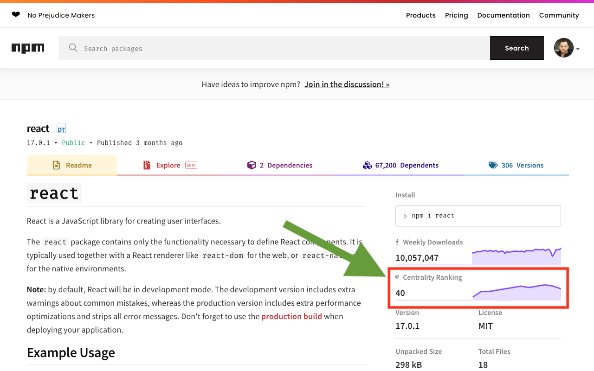

# Centrality Checker (Chrome Extension)

 

This extension will add the centrality information about _npm_ packages when you browse a package on [npmjs.com](https://www.npmjs.com/).
You can install the extension from Chrome Web Store: [Centrality Checker](https://chrome.google.com/webstore/detail/centrality-checker/bmpafkghbmojppjoeienibieljacdoaj).

## Screen Shot

